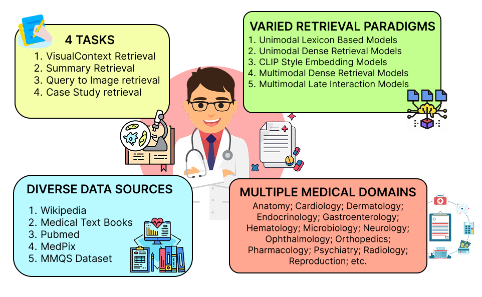
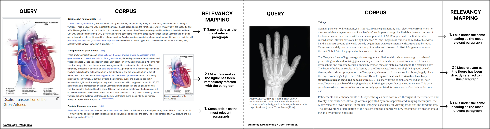

# M3Retrieve: Benchmarking Multimodal Retrieval for Medicine

### Accepted in EMNLP 2025

  

 
#### [Arakdeep Acharya](https://arkadeepacharya.github.io/), [Akash Ghosh](https://scholar.google.co.in/citations?user=NWc6Pw8AAAAJ&hl=en&oi=ao), [Pradeepika Verma](https://scholar.google.com/citations?user=i62Wy3oAAAAJ&hl=en), [Kitsuchart Pasupa](https://scholar.google.com/citations?user=UtzYq_0AAAAJ&hl=en) , [Sriparna Saha](https://scholar.google.com/citations?user=Fj7jA_AAAAAJ&hl=en),[Priti Singh]() 

## About the Paper

**M3Retrieve: Benchmarking Multimodal Retrieval for Medicine** introduces the first large-scale benchmark tailored for multimodal medical retrieval.

- 🚀 **First Multimodal Medical Retrieval Benchmark** – Presents *M3Retrieve*, the first benchmark that systematically evaluates text–image retrieval models in the medical domain.  
- 📚 **Comprehensive Dataset** – Aggregates 22 curated datasets (all under permissive licenses), spanning **16 medical disciplines**, with **1.2M+ text documents** and **164K multimodal queries** covering real-world clinical use cases.  
- 🏥 **Clinically-Grounded Tasks** – Defines five tasks aligned with routine healthcare workflows: Visual Context Retrieval, Multimodal Query-to-Image Retrieval, Case Study Retrieval, and Multimodal Summarisation Retrieval.  
- 📊 **Systematic Evaluation** – Benchmarks a wide range of state-of-the-art uni-modal and multimodal retrieval models, revealing discipline-specific challenges and quantifying retrieval effectiveness.  
- 🌐 **Advancing Medical AI** – Provides a standardized platform to drive innovation in multimodal retrieval systems for healthcare, fostering more reliable and clinically applicable AI models.  

## Overview of Retrieval Tasks

M3Retrieve defines a set of clinically grounded retrieval tasks that reflect real-world medical information-seeking workflows:

- 🖼️ **Visual Context Retrieval** – Given an image and short text (e.g., caption), retrieve the most relevant passage from a large medical corpus.  
- 📑 **Multimodal Summary Retrieval** – From a multimodal query (text + image), retrieve the most appropriate expert-written summary that integrates both modalities.  
- 🧾 **Case Study Retrieval** – Match a multimodal clinical query (patient transcript + image) with the most relevant full case study from medical literature.  
- 🩻 **Multimodal Query-to-Image Retrieval** – Retrieve the most relevant medical image (e.g., X-ray, MRI, pathology slide) based on a multimodal query (text + image).  
- ✅ **Quality-Controlled Curation** – All tasks were curated with medical expert guidance and validated through domain-expert reviews to ensure clinical accuracy and relevance.  

---

  

---

## Evaluation Results

We evaluated a wide range of **uni-modal** and **multimodal retrieval models** on the M3Retrieve benchmark.  
The results below report **NDCG@10 scores** across four retrieval tasks: Visual Context Retrieval, Summary Retrieval, Query-to-Image Retrieval, and Case Study Retrieval.  

- **Best-performing models** are highlighted in **bold**.  
- **Second-best models** are _underlined_.  

| Method      | Visual Context Retrieval | Summary Retrieval | Query-to-Image Retrieval | Case Study Retrieval |
|-------------|--------------------------|-------------------|---------------------------|----------------------|
| **BM-25**   | 38.07                    | 18.16             | N/A                       | **11.50**            |
| E5 Large    | 35.14                    | 70.23             | N/A                       | 7.68                 |
| BGE         | 32.32                    | 83.66             | N/A                       | 6.59                 |
| _NV Embed_  | _43.28_                  | **89.73**         | N/A                       | _10.99_              |
| MM Ret      | 24.56                    | 43.71             | 2.27                      | 1.09                 |
| MII         | 28.13                    | 22.50             | **43.53**                 | 1.64                 |
| CLIP SF     | 26.44                    | 26.30             | 29.06                     | 1.27                 |
| BLIP FF     | 24.72                    | 20.89             | 2.23                      | 0.92                 |
| **MM Embed**| **45.47**                | _76.27_           | _29.49_                   | 9.91                 |
| FLMR        | 24.80                    | 21.30             | 2.56                      | 1.48                 |

**Key Insights:**
- Multimodal models such as **MM Embed** excel in tasks that require integrating both text and images.  
- Uni-modal dense retrievers like **NV Embed** remain highly effective for text-heavy tasks such as summary and case study retrieval.  
- **CLIP-style** and medical-specific models (e.g., **MII**) perform best on image-centric tasks like query-to-image retrieval.  
- Lexicon-based methods (e.g., **BM-25**) still provide competitive baselines in certain settings.

## Qualitative Analysis

To better illustrate the behavior of retrieval models, we conduct a qualitative analysis on sample queries from **M3Retrieve** (Figure 3).  

- For **Visual Context Retrieval**, we observe that relevant paragraphs are often identified not only by explicit figure references but also by contextual alignment within the same article. This highlights the importance of combining both image and textual signals in determining relevance.  
- In the case of **multimodal queries**, the models successfully associate medical images (e.g., heart X-ray, anatomical diagrams) with their corresponding textual descriptions, showcasing the ability of multimodal retrievers to capture fine-grained semantic alignment.  
- However, we also note instances where retrieval models struggle with nuanced medical terminology or subtle image-text distinctions, emphasizing the need for further domain-specific adaptation.  

  

*Figure 3: Examples from M3Retrieve demonstrating how queries (images) are mapped to relevant corpus passages using medical expert-defined relevancy mappings.*

